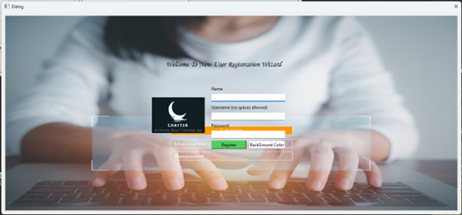
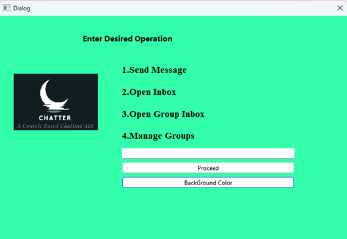
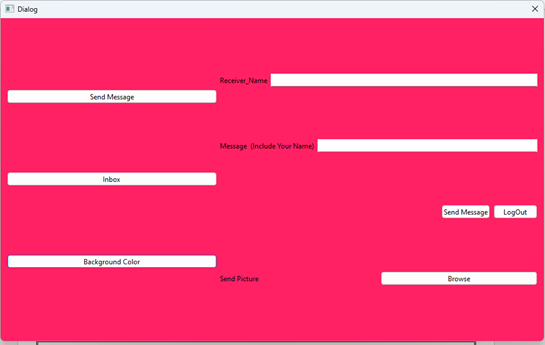
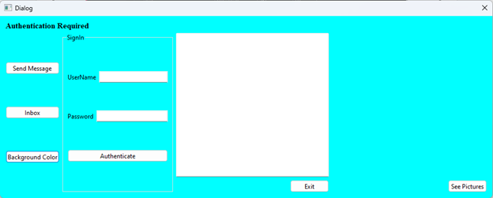

# 💬 Chatter App - Offline Encrypted Messaging Platform


## 📌 Overview
**Chatter App** is a secure, offline chat application built using **C++ and Qt** as a semester project for **Object Oriented Programming (OOP)** at Bahria University. It allows users to communicate via text and images without needing any internet connection, thanks to a **server-based local communication system**.

All communications are encrypted for enhanced privacy. The application supports **user authentication, message history, group chats, and picture sharing** — all packed into a clean, GUI-based desktop experience.

---

## ✨ Features
- 🔐 **User Authentication** with encryption
- 📩 **Send and Receive Messages** offline
- 🖼️ **Send Images** along with text messages
- 👥 **Group Chat Support**
- 🧑‍💼 **Multiple User Registrations**
- 🎨 **Dynamic Background Color Customization**
- 📂 Simple UI and user-friendly navigation

---

## 🧱 Project Goals
- Implement encrypted offline messaging
- Design a clean GUI using Qt
- Allow image sharing via QFileDialog
- Support group chats and message inbox
- Provide smooth user registration and login workflows

---

## 🔍 Project Scope
- Authentication and encrypted messaging
- Offline communication in local environments like schools/offices
- Independent user registration system
- GUI interaction with dynamic components and UI forms

---

## 🛠️ Project Requirements
- Real-time message updates in inbox
- Support for images and multiple user profiles
- Local file handling and storage
- Complete encryption of user credentials and chat content

---

## 🗓️ Project Timeline
| Phase              | Description                                  |
|-------------------|----------------------------------------------|
| **Week 1**         | Planning & requirement gathering             |
| **Week 2**         | Core functionality and UI development        |
| **Week 3**         | Testing (authentication, inbox, group chat) |
| **Week 4**         | Final bug fixes and enhancements             |

---

## 📁 Project Structure
```
Chatter-App/
│── main.cpp                   # Entry point
│── mainwindow.cpp/.h         # Login window
│── signup.cpp/.h             # Signup logic
│── inbox.cpp/.h              # Inbox and message display
│── message_send.cpp/.h       # Send message and picture
│── after_login.cpp/.h        # Post-login main options
│── group_chat_inbox.cpp/.h   # Group chat inbox handling
│── group_chat_management.cpp/.h # Group creation and management
│── *.ui                      # All Qt Designer UI layout files
│── resources/                # Images used in GUI
│── Picture1.png              # Signup Screen
│── Picture2.png              # Main Login Window
│── Picture3.png              # After Login Menu
│── Picture4.png              # Send Message
│── Picture5.png              # Picture Browse Window
│── README.md                 # This file
```

---

## 🖼️ Screenshots

### 🔹 Signup Page
<p align="center">
  
</p>

### 🔹 Main Login Window
<p align="center">
  
</p>

### 🔹 After Login Menu
<p align="center">
  
</p>

### 🔹 Send Message Window
<p align="center">
  
</p>

### 🔹 Picture Browse Window
<p align="center">
  
</p>

---

## 📜 License
This project is for educational purposes only as part of the **OOP Semester Project** at Bahria University.

---

## 🙌 Acknowledgments
- **Instructor:** Ma'am Eruf Ashruf  
- **Submitted By:**
  - Muhammad Awab Sial (01-134222-091)  
  - Syed Amber Ali Shah (01-134222-146)  
  - Muhammad Raza (01-134222-174)  
- **Class:** BS-CS 2B  
- **Session:** Spring 2022  
- **Date:** June 10, 2023
